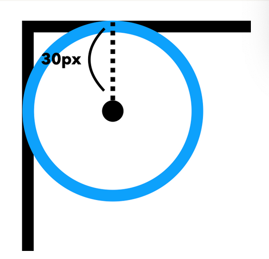

# TIL
## 오늘 배운 것
* [CSS > 3. RESET CSS](#css--3-reset-css)
* [CSS > 4. 공백처리, 주석 및 벤더프리픽스](#css--4-공백처리-주석-및-벤더프리픽스)
* [CSS > 5. CSS Selector](#css--5-css-selector)
* [CSS > 6. 선택자 우선순위](#css--6-선택자-우선순위)
* [CSS > 7. CSS Box Model](#css--7-css-box-model)
* [1만 시간의 법칙 반응형 웹 구현](#1만-시간의-법칙-반응형-웹-구현)
## 과제 및 포트폴리오에 관해
* 캐릭터 경진대회(빔캠프 영상을 통해 나중에 연습해보자!)
* 팀 프로젝트: 감귤마켓(대부분 리액트, MPA)-MPA로 하는건 가산점을 많이 못 받음. 최대한 리엑트로 하자. 바닐라 JS SPA로 하면 가산점 많이 받음.
* 프로그래머스-과제테스트 연습
* 최종 프로젝트 미리 해도 됨(근데 나는 하지 말자.. 실력 안됨)
* 개인: 오픈 마켓
## 팁
* GDG, GDU
* 크로스 브라우징: 몇 버전까지 호환을 해줄 것이냐?
    * 익스플로러: 10버전까지(강사님 의견)
* 빠르게 만드는 연습(반복)
* 인프콘(인프런에 강의 있음)
* 빨리 끝내야할 때 UI 사기
* [flex 연습 사이트](https://flexboxfroggy.com/#ko)
---
# CSS > 3. RESET CSS
* [에릭 마이어의 reset CSS](https://github.com/SEMINSEMINSEMIN/FrontendSchool3/blob/main/220908/CSS%20reset/reset.css): 기존 스타일 모두 제거, 이것도 아직 많이 씀
* normalize.CSS: 브라우저 고유의 스타일을 존중하면서 거기에 스타일을 첨가하는, 좀 더 부드러운 방법, 요즘 많이 씀
* CSS Remedy
---
# CSS > [4. 공백처리, 주석 및 벤더프리픽스](https://github.com/SEMINSEMINSEMIN/FrontendSchool3/blob/main/220908/002.html)
* 벤더프리픽스: 아직 비표준이거나 실험적인 CSS 속성을 특정 브라우저에서 실행할 수 있도록 CSS 속성 앞에 브라우저 제조사 만의 접두어(prefix)를 붙이는 문법
    * 종류: -webkit-(웹킷 기반 브라우저), -moz(파이어폭스 브라우저), -ms-(IE, legacy edge), -o-(legacy 오페라)
    * 웹킷 기반 브라우저란?
        * 웹킷: 브라우저가 HTML, CSS를 화면에 그려줄때 사용하는 렌더링 엔진
        * 현재 크롬, 안드로이드, 오페라, 엣지 등은 Blink 엔진으로 전환(벤더프리픽스 존재 x)
* [오토 프리픽서](https://autoprefixer.github.io): 벤더프리픽스 자동화
---
# CSS > 5. CSS Selector
* [전체 선택자, 타입 선택자](https://github.com/SEMINSEMINSEMIN/FrontendSchool3/blob/main/220908/003.html)
* [id 선택자](https://github.com/SEMINSEMINSEMIN/FrontendSchool3/blob/main/220908/004.html)
    * id 선택자를 이용해 현재 페이지에서 이동하는 해쉬 링크를 만들 수도 있다
```html
<!DOCTYPE html>
<html>
<head>
    <meta charset="UTF-8">
    <title>Document</title>
    <style>
    #one{ color: red; }
    
    #two{ color: blue; }
    
    #three{ color: green; }
    </style>
</head>
<body>
    <a href="#one">one으로 가라</a>
    <a href="#two">two으로 가라</a>
    <a href="#three">three으로 가라</a>
    <h1 id="one">hello</h1>
    <h1 id="two">hello</h1>
    <h1 id="three">hello</h1>
</body>
</html>
```
* [class 선택자](https://github.com/SEMINSEMINSEMIN/FrontendSchool3/blob/main/220908/005.html)
* 선택자 목록: 콤마(,)로 선택자를 연결
```css
h1, h2, h3 {color: red};
* https://github.com/SEMINSEMINSEMIN/FrontendSchool3/blob/main/220908/006.html
```
---
# CSS > 6. 선택자 우선순위
## 6.1 후자 우선의 원칙
* **같은** 우선순위 중 뒤에 오는 거 선택
## [6.2 구체성의 원칙](https://github.com/SEMINSEMINSEMIN/FrontendSchool3/blob/main/220908/007.html)
1. id > class > 타입 순으로
2. 우선 순위 계산
    * inline-style(1000), id(100), class/가상클래스/속성선택자(10), 타입/가상요소 선택자(1), *(0)
    * [계산해주는 링크](https://specificity.keegan.st/)
* [class를 100개 써도 id 1개보다 우선순위가 항상 낮다](https://github.com/SEMINSEMINSEMIN/FrontendSchool3/blob/main/220908/008.html)
## 6.3 중요성의 원칙
* [!important](https://github.com/SEMINSEMINSEMIN/FrontendSchool3/blob/main/220908/009.html)
    * 가중치 점수를 무시하고 무조건적인 우선 순위를 가짐
    * 인라인 스타일을 덮어써야하는 등의 불가피한 상황이 아니라면 사용을 지양하자
---
# CSS > 7. CSS Box Model
## [7.1 박스의 구성](https://github.com/SEMINSEMINSEMIN/FrontendSchool3/blob/main/220908/010.html)
* content, [padding](https://github.com/SEMINSEMINSEMIN/FrontendSchool3/blob/main/220908/011.html), border, margin
## 7.2 박스의 유형(중요)
* 블록 박스
* 인라인 박스
* 박스 유형
    * 외부 디스플레이 타입 - display: inline;, display: block;, display: inline-block;
    * 내부 디스플레이 타입 - display: flex(X축 혹은 Y축 단방향), display: grid(X축 혹은 Y축 양방향)
## 7.3 표준 CSS 박스 모델
1. [width, height](https://github.com/SEMINSEMINSEMIN/FrontendSchool3/blob/main/220908/012.html): 블록 박스일 경우 **content** box 크기 제어(단, box-sizing이 border-box인 경우 border 기준으로 크기 제어)
2. [border](https://github.com/SEMINSEMINSEMIN/FrontendSchool3/blob/main/220908/013.html)

3. padding, margin
* margin 겹침 현상
    * 형제 간
    * 부모 자식 간
## 7.4 대체 CSS 박스 모델
---
# 1만 시간의 법칙 반응형 웹 구현
## img vs background-img
* img: 백엔드 입장에서 컨트롤 해야하는 이미지
* background-img: 변경되지 않을 이미지, 백엔드 입장에서 컨트롤 하지 않아도 되는 이미지
